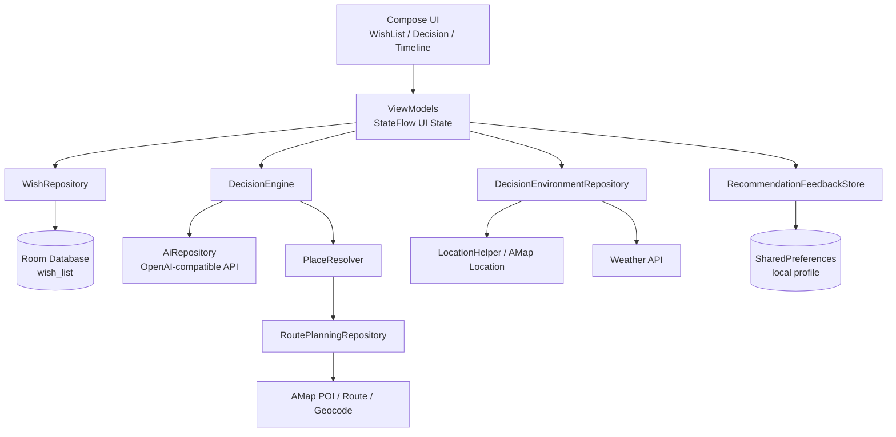

# 佳期 Jiaqi

佳期是一个面向情侣约会的 Android App。它的起点很简单：两个人每次出门前都不知道今天要做什么，于是把“去哪儿、吃什么、怎么走”变成一个温柔、轻量、可刮开的决策流程。

它不是一个重后台的路线平台，也不是把 AI 摆在台前的聊天工具。佳期的核心理念是：

- 本地优先：心愿、反馈和画像都保存在设备本地。
- 隐形 AI：AI 负责理解、推荐和补全，但不打断用户体验。
- 温润极简：界面尽量接近 iOS 式的干净、柔和、低负担。
- 环境感知：结合时间、位置、天气和路线，让推荐更像“现在就适合去”。

## 当前能力

### 语义化心愿池

用户可以直接输入自然语言，例如“想去江汉路吃烤肉”或“周末去东湖边走走”。App 会通过兼容 OpenAI Chat Completions 的大模型接口解析出结构化心愿，并存入本地 Room 数据库。

心愿数据模型包含标题、分类、地点关键词、经纬度、是否打卡、来源等字段。列表 UI 使用 Compose + Flow/StateFlow 响应式刷新，支持本地增删改查和打卡状态切换。

### 刮刮乐决策

核心体验是 Magic Scratch Card。用户可以在“餐厅”和“玩乐”之间切换，然后抽一张建议卡。卡片上层使用 Compose Canvas 绘制遮罩，手指刮开时通过 `BlendMode.Clear` 擦除，并带有轻微触感反馈。

卡片揭开后支持：

- 高德导航：直接打开高德地图路线。
- 小红书搜索：用当前地点关键词跳转搜索。
- 左滑加入心愿池：把 AI 推荐保存为未来想去的地方。
- 右滑不感兴趣：记录负反馈，降低相似推荐出现概率。

### 环境感知推荐

推荐前会收集当前上下文：

- 当前系统时间，使用 `Asia/Shanghai` 时区。
- 高德定位和系统定位兜底。
- 天气接口返回的天气描述。
- 高德 POI/路线能力解析推荐地点，避免地点错位。

AI 返回的候选地点会经过 `DecisionEngine` 二次筛选，包括时间匹配、天气适配、距离合理性、地点解析置信度、重复惩罚和个性化得分。

### AI 预取缓存

为了减少用户等待，前台抽卡走单结果极速路径，后台空闲时会补充多候选 AI 缓存。用户下一次刮卡时可以优先命中缓存，缓存也会根据时间、天气、位置变化自动过期。

### 本地个性化画像

佳期目前已经实现本地个性化推荐，不依赖外部用户画像平台。系统会记录这些行为：

- 保存到心愿池。
- 点击高德导航。
- 点击小红书搜索。
- 右滑不感兴趣。

画像只保存在本地 `SharedPreferences`，不会上传自定义服务器。画像会抽取地点类型特征，例如咖啡、书店、电玩、手作、江边、公园、livehouse、商场小店等，并使用：

- 正负反馈权重。
- 最近反馈加权。
- 旧反馈衰减。
- 当前时间段加权。
- 同名/近似地点短期去重。

AI prompt 和本地候选排序都会读取同一份画像，因此推荐会逐渐更接近用户最近真实选择。

## 架构概览



项目没有自定义后端服务器。核心业务数据在本地，外部服务只用于 AI 解析/推荐、高德定位/路线/地点解析和天气查询。

## 技术栈

- Kotlin + Jetpack Compose
- Material 3
- Room + Flow
- ViewModel + StateFlow
- Retrofit + OkHttp + Gson
- 高德地图 3D 地图/定位/搜索整合包
- Coil Compose
- Java 17
- Min SDK 26，Target SDK 36

## 目录结构

```text
app/src/main/java/com/example/dateapp
├── AppContainer.kt                         # 手动依赖注入入口
├── MainActivity.kt                         # Compose 主入口和页面切换
├── data
│   ├── local                               # Room entity / dao / database
│   ├── remote                              # AI、天气、高德 HTTP 接口
│   ├── decision                            # AI 决策引擎和候选排序
│   ├── environment                         # 时间、位置、天气上下文
│   ├── place                               # 推荐地点解析
│   ├── route                               # 高德路线、POI、兜底估算
│   └── recommendation                      # 本地个性化画像
└── ui
    ├── wish                                # 心愿池界面
    ├── decision                            # 刮刮乐决策界面
    ├── timeline                            # 行程/导航相关界面
    ├── components                          # 通用按压反馈
    └── theme                               # 温润极简主题
```

## 本地配置

项目读取根目录 `local.properties`，该文件已被 `.gitignore` 忽略，不应提交真实密钥。

示例：

```properties
sdk.dir=C\:\\Users\\your-name\\AppData\\Local\\Android\\Sdk

ai.baseUrl=https://your-openai-compatible-endpoint/
ai.apiKey=YOUR_AI_API_KEY
ai.model=gpt-5.4-mini
ai.decisionModel=gpt-5.4-mini

amap.apiKey=YOUR_AMAP_API_KEY
```

说明：

- `ai.baseUrl` 需要以 `/` 结尾；代码里也会做一次兜底补齐。
- AI 接口使用 Chat Completions 风格请求，并通过 Bearer Token 认证。
- `amap.apiKey` 会注入到 `AndroidManifest.xml` 的高德 `meta-data`。
- 定位和路线能力需要在设备上授予定位权限。

## 构建与运行

使用 Android Studio 打开项目根目录，等待 Gradle Sync 完成后运行 `app` 即可。

命令行构建：

```powershell
./gradlew.bat assembleDebug
```

安装到已连接设备：

```powershell
& "$env:LOCALAPPDATA\Android\Sdk\platform-tools\adb.exe" install -r "app\build\outputs\apk\debug\app-debug.apk"
& "$env:LOCALAPPDATA\Android\Sdk\platform-tools\adb.exe" shell am start -n com.example.dateapp/.MainActivity
```

## 关键日志

联调推荐链路时可以关注这些 tag：

- `DecisionViewModel`：抽卡、缓存、偏好画像、用户反馈。
- `DecisionEngine`：候选筛选、地点解析、个性化得分。
- `RoutePlanningRepository`：目的地解析、路线规划、兜底估算。
- `DecisionEnvironmentRepository`：定位、天气、环境快照。

示例信号：

```text
decision source=PREFERENCE_PROFILE category=play hour=10 ...
decision source=ENGINE_PERSONAL_SCORE targetCategory=play ...
decision source=AI_CACHE_HIT targetCategory=play ...
route source=decision_place ...
```

## 设计原则

佳期的 UI 方向是 Warm Minimalism：

- 大圆角、柔和背景、轻阴影。
- 避免冷硬控制台风格。
- 刮刮乐、页面切换、按压反馈使用弹簧或缓动动画。
- 加载时使用卡片边缘呼吸发光，而不是生硬的转圈。
- AI 尽量隐身，用户看到的是地点、路线和下一步行动。

## 隐私边界

当前实现遵循单机本地优先：

- 心愿池保存在 Room。
- 个性化画像保存在 SharedPreferences。
- 没有自建后端。
- 不读取第三方 App 的非授权数据。
- 第三方 API 只用于完成用户主动触发的解析、推荐、定位、天气和路线能力。

## 后续方向

- 增加画像解释页，让用户看到“佳期为什么这样推荐”。
- 继续强化地点类型多样性，避免同类玩法连续出现。
- 将包名、应用展示名和 release 签名配置整理为正式发布形态。
- 增加轻量测试，覆盖 AI JSON 清洗、画像打分、路线兜底等核心逻辑。

